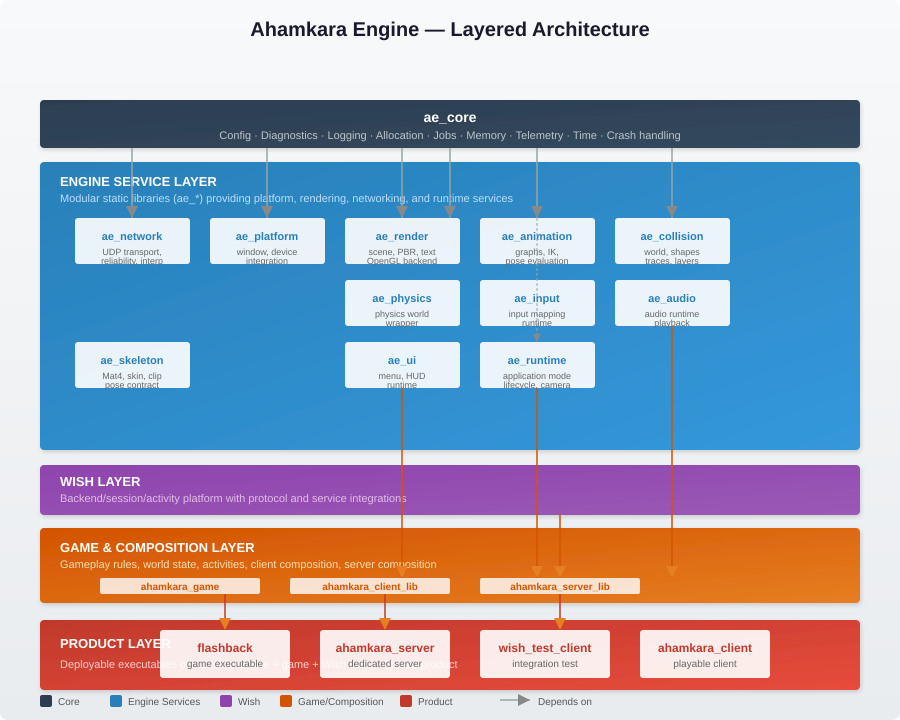

# Architecture

This section describes the system-wide architecture of the Ahamkara project — the
boundaries between engine, game, and backend services, the dependency direction
between them, and the architectural invariants that guide development.

## Architecture documents

- [Overview](overview.md) — current monorepo composition, target
  three-repository structure, runtime data flow, and architectural invariants.
- [Repository split](repository-split.md) — extraction boundaries and
  dependency rules for Ahamkara, Flashback, and Wish.

## Related documentation

- [Subsystem architecture](../systems/architecture.md) — detailed engine module
  composition with dependency map and known boundary defects.
- [Design proposals](../design/README.md) — proposed or accepted mechanisms
  before they become subsystem truth.
- [Build and test guide](../guides/building.md) — how to build, test, and run
  the project.

Executable migration work belongs in
[GitHub Issues](https://github.com/tfq26/Project-Ahamkara/issues).

## Architectural layers

The project follows a layered architecture with strict dependency direction:

| Layer | Ownership | Key modules | Depends on |
|---|---|---|---|
| **Core** | Ahamkara | `ae_core` | — |
| **Engine services** | Ahamkara | `ae_runtime`, `ae_network`, `ae_render`, `ae_animation`, `ae_physics`, `ae_collision`, `ae_platform`, `ae_input`, `ae_audio`, `ae_ui`, `ae_skeleton` | Core |
| **Wish** | Wish | `wish_engine` (session, activity, replication, admin) | Core, Network |
| **Game & composition** | Flashback | `ahamkara_game`, `ahamkara_client_lib`, `ahamkara_server_lib` | Engine services, Wish |
| **Product** | Flashback | `flashback` executable, `ahamkara_server`, `ahamkara_client` | Game & composition |

See [overview.md](overview.md) for the full architectural description with
Mermaid diagrams of current and target dependency graphs.

## Build system

The project uses **CMake 3.20+** with Ninja as the build system. Multiple build
presets support different workflows:

| Preset | Configuration | Use case |
|---|---|---|
| `debug` | Full symbols, no optimisation | Local development with LSP support (`compile_commands.json`) |
| `release` | Optimised | Performance testing and profiling |
| `debug-headless` | Debug without GLFW/OpenGL | Remote agents, CI, server-only builds |
| `wish-standalone` | Core + Wish only, no game/client/server/samples | Wish platform development |

[src: file: CMakePresets.json:8-73]

## CI/CD pipeline

Continuous integration runs on a self-hosted Linux runner (`servlenovo1`):

1. **Lint** — change-aware clang-tidy on the diff via `scripts/lint.sh`
2. **Build & test** — matrix across `debug`, `release`, and `debug-headless`
   presets; CTest runs on `debug` and `debug-headless`
3. **Package** — CPack creates TGZ/ZIP archives for distribution
4. **Auto-merge** — agent branches under `agent/automerge/**` may merge into
   `develop` automatically after green CI

[src: file: .github/workflows/ci.yml:1-149]

## Deployment model

The dedicated game server (`ahamkara_server`) is deployed as a **Docker
container** built from a multi-stage Dockerfile:

- **Build stage**: compiles `ahamkara_server` under Ubuntu 24.04 using the
  `debug-headless` preset
- **Production stage**: copies only the server binary and runtime dependencies
  into a slim Ubuntu 24.04 image
- **Runtime configuration**: server port, admin port, tick rate, max players,
  disconnect timeout, and match duration are set via environment variables
- **Orchestration**: `docker-compose.yml` provides a ready-to-use server
  deployment with configurable ports and game parameters

[src: file: Dockerfile:1-41]
[src: file: docker-compose.yml:1-15]

The client and Flashback executable are not containerised; they run natively for
development and will be distributed via CPack packages for end users.

## Key design decisions

- **Monorepo → three repos**: the current transitional monorepo will split into
  Ahamkara (engine), Flashback (game), and Wish (backend) once internal
  boundaries are proven and package contracts stabilise.
- **Engine-only builds**: `AHAMKARA_ENGINE_ONLY=ON` disables game, client,
  server, and Wish targets, enabling third-party consumers to depend solely on
  engine libraries.
- **GameModule contract**: `ae::IGameModule` provides a versioned runtime
  contract (`initialize`/`tick`/`shutdown`) so Flashback game types never
  appear in Ahamkara headers.
- **No sibling includes after split**: each repository must configure, build,
  test, and package without referencing sibling source directories.
- **Stable error identities**: subsystem boundary failures use stable error
  codes, not bare log strings (see [error-system proposal](../design/error-system.md)).

