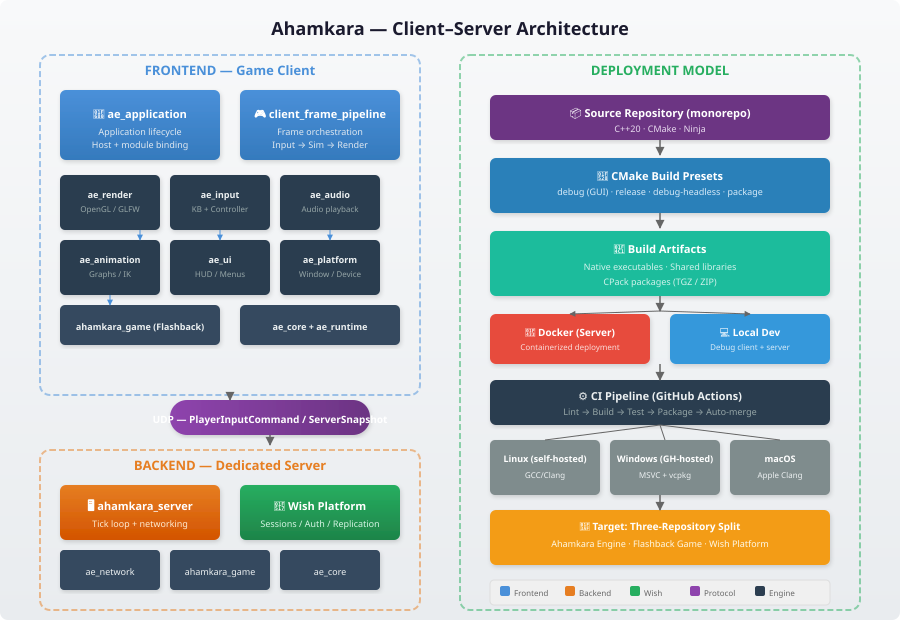
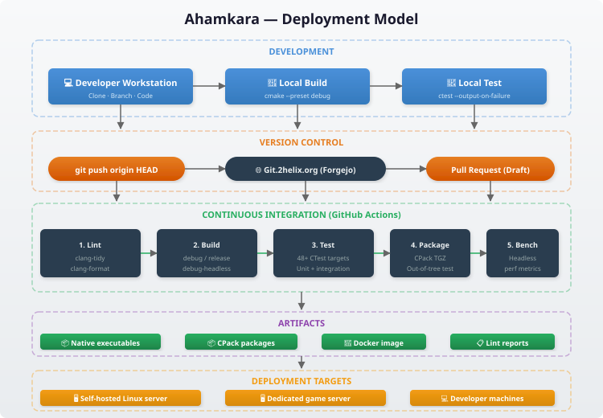

# Client–Server Architecture

Status: Current implementation description

This document describes the runtime separation between the game client
(frontend) and the dedicated server + platform layer (backend), their
communication protocol, and how each component is built and deployed.

## Overview

Ahamkara follows a standard authoritative-server multiplayer architecture:

- **Frontend**: The playable game client — a C++20 native application built
  with GLFW3 and OpenGL. It handles input, rendering, audio, animation, UI,
  and local simulation.
- **Backend**: The dedicated server — a headless C++20 process that owns
  authoritative game state, player sessions, and replication. The Wish
  platform adds session management, authentication, and service integration.

The two communicate over a custom UDP protocol at ~60 Hz.

### Frontend — Game Client

The game client is a native graphical application composed from engine modules
and game-specific layers:

| Layer | Module(s) | Responsibility |
|---|---|---|
| Application | `ae_application` | Lifecycle, host binding, `ae::IGameModule` |
| Frame pipeline | `ClientFramePipeline` | Per-frame orchestration: input → simulation → scene → render → audio → UI |
| Graphics | `ae_render`, `ae_platform` | OpenGL rendering, window management (GLFW3) |
| Animation | `ae_animation`, `ae_skeleton` | Graph evaluation, IK, pose palettes, weapon clip playback |
| Input | `ae_input` | Keyboard and controller mapping |
| Audio | `ae_audio` | Playback and mixing |
| UI | `ae_ui` | HUD and menu rendering |
| Simulation | `ahamkara_game` (Flashback) | World state, movement, weapons, abilities, AI |
| Core | `ae_core`, `ae_runtime` | Diagnostics, logging, allocation, metrics, camera |

The client sends `PlayerInputCommand` packets each tick and renders the latest
authoritative `ServerSnapshot` with client-side prediction for local
responsiveness.

### Backend — Dedicated Server

The dedicated server is a headless process that runs the same game simulation
as the client but without graphical or audio subsystems:

| Layer | Module(s) | Responsibility |
|---|---|---|
| Server loop | `ahamkara_server` | Socket polling, authentication, admission, activity routing, ticking, snapshot broadcast |
| Platform | `wish_engine` + Wish modules | Sessions, parties, matchmaking, activity lifecycle, Nakama adapter |
| Game simulation | `ahamkara_game` | Authoritative world state, movement validation, weapon damage |
| Networking | `ae_network` | UDP transport, reliability, interpolation |
| Core | `ae_core` | Diagnostics, allocation, logging, telemetry |

The server never runs a renderer or audio system. It runs at a fixed tick rate
(default 60 Hz) and broadcasts snapshots to all connected clients.

### Communication Protocol

| Aspect | Detail |
|---|---|
| Transport | UDP |
| Direction | Bidirectional |
| Client → Server | `PlayerInputCommand` (movement, actions, weapon state) at ~60 Hz |
| Server → Client | `ServerSnapshot` (authoritative positions, events, state) at ~60 Hz |
| Reliability | Custom sequencing, ack, and interpolation over UDP |

Client-side prediction reconciles local movement against authoritative server
snapshots to mask round-trip latency.

## Deployment Model

### Build System

The project uses CMake with Ninja as the primary generator. Three build presets
cover different deployment scenarios:

| Preset | Use case | Components |
|---|---|---|
| `debug` | Local development | Full client + server + tests, debug symbols |
| `release` | Performance testing | Full build with optimizations |
| `debug-headless` | CI, headless testing | Server + game + engine only (no GLFW/OpenGL) |
| `package` | Distribution | Install targets + CPack archives (TGZ/ZIP) |

### CI Pipeline

GitHub Actions runs on every push and pull request:

1. **Lint** — clang-tidy, clang-format on the branch diff.
2. **Build** — All three presets (debug, release, debug-headless) on Linux
   (self-hosted) and Windows (MSVC + vcpkg).
3. **Test** — 48+ CTest targets including unit tests, integration tests, and
   out-of-tree consumer tests.
4. **Package** — CPack produces TGZ and ZIP archives. The headless package is
   validated by an out-of-tree consumer build.
5. **Benchmark** — Headless benchmarks capture performance metrics and detect
   regressions.

### Deployment Targets

| Target | Method | Typical use |
|---|---|---|
| Self-hosted Linux | Docker container or native binary | Production game server |
| Dedicated server | `ahamkara_server` binary or Docker | Multiplayer sessions |
| Developer machines | `./scripts/start.sh` or manual CMake | Local development and testing |
| CI runners | GitHub Actions with `cmake --preset` | Automated validation |

### Docker

A `Dockerfile` at the repository root builds the dedicated server for
containerized deployment. See [`Dockerfile`](../../Dockerfile) and
[`docker-compose.yml`](../../docker-compose.yml) for details.

## Design Decisions

### C++20

The engine and game are written in modern C++20 for performance, deterministic
memory management, and tight hardware control — all critical for a 60 Hz game
loop. No garbage collection, no VM overhead.

### Monorepo (Transitional)

The current single repository simplifies cross-module refactoring during early
development. The target architecture splits into three independent repositories:

- **Ahamkara** — reusable engine + SDK
- **Flashback** — the game product
- **Wish** — backend/session platform

The split will happen after internal package boundaries are validated. See
[repository-split.md](repository-split.md) for the migration plan.

### UDP over TCP

UDP was chosen for the game protocol because:

- Predictable per-packet latency (no head-of-line blocking).
- Custom reliability per message type (position updates tolerate loss; fire
  events need delivery guarantees).
- No TCP congestion algorithm fighting a 60 Hz game tick.

### Engine Modularity

Twelve engine modules (`ae_core`, `ae_network`, `ae_render`, etc.) enforce
separation of concerns via CMake target boundaries. The render/animation cycle
was broken by extracting shared skeleton types into `ae_skeleton`, establishing
a one-way dependency chain.

### Client-Side Prediction

To maintain responsive controls under network latency, the client runs a
local simulation of player movement and reconciles with authoritative server
snapshots. This is transparent to the player and handled inside
`ClientFramePipeline`.

## Related Documents

- [Architecture overview](overview.md) — target system and module composition
- [Repository split](repository-split.md) — extraction boundaries for Ahamkara,
  Flashback, and Wish
- [Networking model](../systems/networking.md) — UDP protocol details and
  reliability layer
- [Client frame pipeline](../systems/client_config.md) — per-frame orchestration
- [Building from source](../guides/building.md) — platform-specific build
  instructions
