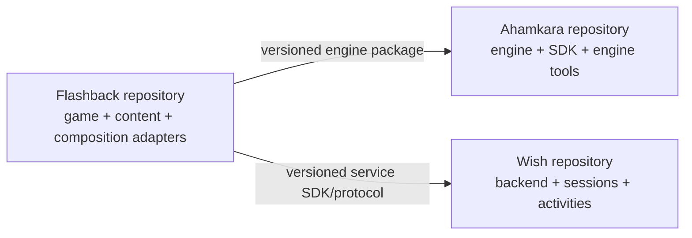
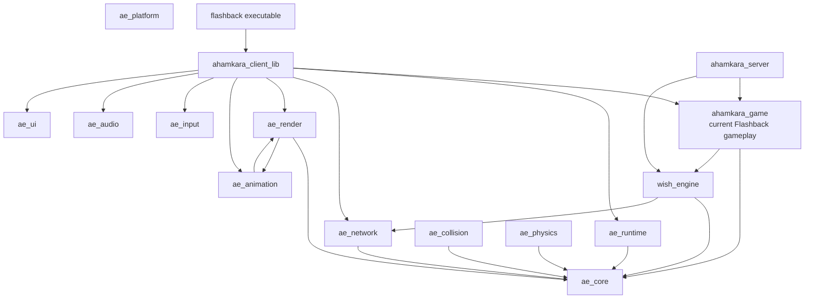

# Architecture overview

Status: Current-state description plus accepted target direction

> See the [architecture landing page](README.md) for a high-level layered
> diagram and layer summary.

## Product model

The current repository is a transitional monorepo. Its root build adds core
engine modules, Wish, and the game layer in one configuration; graphical builds
then add platform, render, animation, UI, input, audio, client, tools, and the
Flashback sample. [src: file: CMakeLists.txt:104-145]

The accepted destination is three independent repositories and projects:

- **Ahamkara** — reusable game engine, runtime host, SDK, engine tools, and
  engine tests.
- **Flashback** — the game: gameplay, presentation, content, product
  configuration, and the adapters that compose Ahamkara with Wish.
- **Wish** — independent backend/session/activity platform with its own
  protocol and service integrations.

[src: user:taufeeqali:2026-07-13: requested Ahamkara, Flashback, and Wish as completely separate repositories and projects]

## Target dependency direction



The rules are deliberately strict:

1. Ahamkara must not include or name Flashback or Wish.
2. Wish must not include Ahamkara or Flashback game types.
3. Flashback may consume released versions of Ahamkara and Wish.
4. Ahamkara-to-Wish translation required by the game belongs to Flashback.
5. Every repository must configure, build, test, and package without sibling
   source directories.

## Current implementation composition



This graph is descriptive, not the desired boundary. The render and animation
targets currently link each other [src: file: engine/render/CMakeLists.txt:47-55]
[src: file: engine/animation/CMakeLists.txt:21-24], the game target links Wish
[src: file: game/CMakeLists.txt:41-49], and Flashback is a thin executable over
the shared client library [src: file: samples/flashback/CMakeLists.txt:1-13].

## Runtime data flow

The current graphical path constructs an `ae::Application` and a concrete
`ClientFramePipeline`; the pipeline owns named stages for input, simulation
snapshots, scene building, audio, rendering, UI, presentation, and post-frame
work. [src: file: client/include/ahamkara/client/client_frame_pipeline.h:37-124]

The current dedicated-server path owns socket polling, authentication,
admission, concrete activity routing, activity ticking, and snapshot broadcast
inside one executable loop. [src: file: server/src/dedicated_server_main.cpp:210-410]

The target architecture moves generic lifecycle and service contracts behind
Ahamkara and Wish APIs while Flashback supplies concrete gameplay and
presentation modules. See [repository-split.md](repository-split.md).

## Architectural layers

| Layer | Current owner | Target owner |
|---|---|---|
| Core utilities, diagnostics, runtime primitives | `engine/core`, `engine/runtime` | Ahamkara |
| Platform, input, rendering, animation, collision, physics, audio, UI | `engine/*` | Ahamkara |
| Generic network transport and timing | `engine/network` | Ahamkara |
| Gameplay rules, world state, weapons, activities | `game/` | Flashback |
| Product client presentation and configuration | mixed in `client/` | Flashback, consuming an Ahamkara host |
| Sessions, admission, activities, replication, service integration | `wish/` plus `server/` | Wish, with Flashback-owned adapters |
| Product content and default levels | `assets/`, `samples/flashback/` | Flashback |

## Architecture invariants

- Public APIs point from products toward lower-level dependencies; lower-level
  repositories never reach back into products.
- A public header may expose only types from its own package or declared public
  dependencies.
- A runtime failure crossing a subsystem boundary is represented by a stable
  error identity, not only a log string. See
  [the error-system proposal](../design/error-system.md).
- Tests exist at the same boundary being claimed: unit tests for local logic,
  integration tests for module composition, and out-of-tree consumer tests for
  package boundaries.
- Strategic docs describe intent; GitHub Issues own mutable execution state.

## Migration

The split should happen after package boundaries can be proven inside the
monorepo. Extracting directories first would preserve hidden includes and make
three repositories fail independently. The required sequence and exit gates
are documented in [repository-split.md](repository-split.md); work status stays
in [GitHub Issues](https://github.com/tfq26/Project-Ahamkara/issues).


## Render / Animation Dependency

As of the render/animation cycle break, pose ownership is one-way:

```
ae_core
   |
   v
ae_skeleton          # Mat4, Skin, ClipData, evaluate_*, PosePalette
   |
   +--------------> ae_animation   # graphs, IK, clip player (headless)
   |                     |
   |                     | (private link from render composition only)
   v                     v
ae_render  -------- uses pose palette / clip player for skinning presentation
```

Rules:
- `ae_animation` must not link OpenGL, GLFW, or `ae_render`.
- `ae_render` may depend on `ae_skeleton` (public pose contract) and may privately use `ae_animation` for presentation helpers such as weapon clip playback.
- Shared skeleton/pose types live only in `ae_skeleton`.

## Engine-only package mode

Pure engine package builds can be configured with:

```bash
cmake -S . -B build-engine-only -G Ninja \
  -DAHAMKARA_ENGINE_ONLY=ON \
  -DAHAMKARA_BUILD_TESTS=OFF
cmake --build build-engine-only --target ae_core ae_network ae_runtime
cmake --install build-engine-only --prefix ./build-engine-only/install --component Ahamkara
```

Out-of-tree consumers then use:

```cmake
find_package(Ahamkara CONFIG REQUIRED)
target_link_libraries(app PRIVATE Ahamkara::Core Ahamkara::Runtime Ahamkara::Network)
```

This mode excludes Wish/Flashback/client/server/samples and does not fetch Jolt.


## GameModule runtime contract

Ahamkara hosts product games through `ae::IGameModule`:

- `initialize(host)` / `tick(frame)` / `shutdown()`
- versioned by `GameModuleApiVersion` (`major` must match)
- `ae::Application` owns host lifecycle and optional module binding
- Graphical and headless hosts share the same contract; presentation systems remain outside the module interface

This keeps Flashback product types out of the engine while allowing deterministic headless lifecycle tests.
