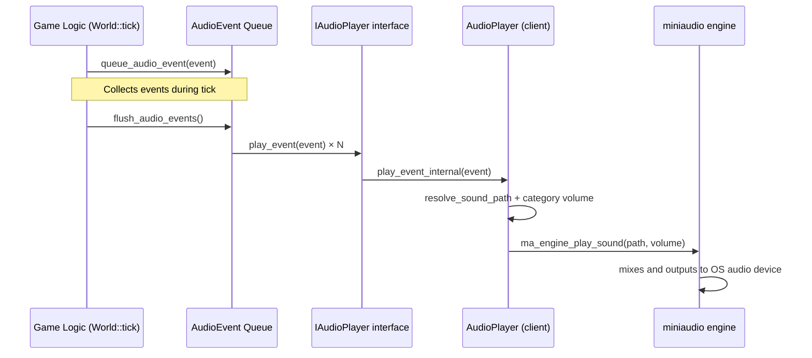

# Audio Architecture

## Status: Event-Based Foundation Implemented

## Overview

The Ahamkara audio system is a **client-only** subsystem. The dedicated server
is headless and does not link any audio library. All sound playback is handled
by the client's `AudioPlayer` implementation using **miniaudio** as the
cross-platform audio backend.

Gameplay code queues `AudioEvent` structs during the simulation tick and the
World flushes them to the `IAudioPlayer` at the end of each tick. This decouples
game logic from audio rendering.

## Architecture Diagram



## Event-Based Dispatch

Game systems do **not** call `audio_player->play_sound()` directly. Instead they
queue an `AudioEvent`:

```cpp
// In World::update_projectiles, on hit confirmation:
queue_audio_event(AudioEvent{
    .sound_key = is_critical ? "crit" : "hit",
    .position  = hit_position,
    .volume    = is_critical ? 1.0f : 0.8f,
    .category  = AudioCategory::SFX
});
```

Events carry full metadata: position (for future 3D spatialization), volume,
bus category, and surface type. The World collects them and dispatches them
at the end of `tick_internal()` via `flush_audio_events()`.

## Mixer Buses (AudioCategory)

| Category   | Bus         | Config Key              | Typical Content               |
|------------|-------------|-------------------------|-------------------------------|
| `Master`   | Master out  | `audio_master_volume`   | Final mix before OS device    |
| `SFX`      | SFX bus     | `audio_sfx_volume`      | Hits, impacts, footsteps      |
| `Weapon`   | Weapon bus  | `audio_weapon_volume`   | Fire, reload, equip           |
| `UI`       | UI bus      | `audio_ui_volume`       | Menu clicks, HUD alerts       |
| `Voice`    | Voice bus   | _(future)_              | VoIP chat                     |
| `Music`    | Music bus   | `audio_music_volume`    | Background BGM                |
| `Ambient`  | Ambient bus | `audio_ambient_volume`  | Wind, reverb tails, room tone |

Each bus has an independent volume slider controlled by `ClientConfig`. The
effective volume for an event is `event.volume × category_volume`, clamped to
[0.0, 1.0]. The Master volume is applied as a final stage.

## Per-Feature Audio Plan

### 81. 3D Spatial Audio

The `AudioEvent::position` field carries the world-space source position.
miniaudio supports 3D spatialization via `ma_sound_set_position()`. When
the audio asset pipeline is in place, `play_event_internal()` will:

1. Allocate a `ma_sound` from the engine for each event.
2. Set its world position to `event.position`.
3. Set the listener position to the camera/player position.
4. Let miniaudio apply HRTF or pan-law attenuation.

### 82. Low-Latency Weapon Audio Path

Weapon fire events use `AudioCategory::Weapon`, routed to a dedicated bus.
For critical-latency sounds (gunfire), the event carries an `is_2d = false`
flag to enable 3D processing. In the future, a priority ring buffer can
skip the normal event queue for weapon sounds, playing them immediately
with zero-frame delay.

### 83. Surface-Dependent Footstep Audio

The `AudioEvent::surface` field (a `SurfaceType` enum) selects which footstep
sample to play. Movement code runs surface-detection (raycast downward) and
populates the event:

```cpp
// Example: Movement system detects player is on metal grating
AudioEvent footstep;
footstep.sound_key = "footstep";  // base key
footstep.surface   = SurfaceType::Metal;
footstep.position  = player_feet_pos;
footstep.category  = AudioCategory::SFX;
footstep.volume    = 0.6f;  // quieter than weapon fire
```

The `AudioPlayer` resolves this to an asset path like
`"assets/audio/footsteps/metal/footstep_01.ogg"`.

### 84. Audio Mixer with Buses

The per-category volume array in `AudioPlayerImpl` is the foundation.
miniaudio's `ma_engine` can be extended with `ma_sound_group` objects that
act as sub-mix buses. Each `ma_sound_group` can have its own volume and
DSP effects chain.

Future implementation:

```cpp
// Conceptual: one ma_sound_group per AudioCategory
ma_sound_group sfx_bus;
ma_engine_init_sound_group(&engine, 0, &sfx_bus);
ma_sound_group_set_volume(&sfx_bus, category_volumes_[SFX]);
// Route new sounds into the bus instead of engine root
ma_engine_play_sound_ex(&engine, path, &sfx_bus);
```

### 85. Occlusion/Obstruction Audio Model

The `AudioEvent::position` and the listener position are known. An
occlusion query (raycast from listener to source) can determine if the
sound is obstructed. Results modulate volume and apply a low-pass filter.

```cpp
// Pseudocode for occlusion processing in AudioPlayer
float occlusion = raycast_occlusion(listener_pos, event.position);
if (occlusion > 0.0f) {
    vol *= (1.0f - occlusion * 0.8f);   // volume attenuation
    apply_low_pass(cutoff = lerp(20000, 500, occlusion));  // HF damping
}
```

### 86. Reverb Zones

Reverb zones are spatial volumes tagged with reverb presets (SmallRoom,
LargeHall, Canyon, etc.). When the listener enters a zone, the
`ma_engine`'s reverb parameters are crossfaded to the zone's preset.
Zone volumes are stored in the ECS as trigger components.

### 87. Networked Sound Event Prediction

Server-authoritative sound events travel with game state snapshots.
The `ClientPredictionManager` already reconciles game state; audio
events can be predicted client-side (play immediately) and then
confirmed or rolled back when the server snapshot arrives. For
non-critical sounds (ambient, music), server authority with a
small interpolation buffer is sufficient.

### 88. Audio Asset Streaming

The current `resolve_sound_path()` function is a thin lookup table.
The planned asset pipeline will:

1. **Pack sounds** into a `.ahk_audio` archive at build time.
2. **Stream** audio data on-demand from disk via miniaudio's
   `ma_resource_manager` with lazy loading.
3. **Preload** critical sounds (weapon fire, footsteps) at map load.
4. **Evict** unused sounds under memory pressure.

### 89. Debug Audio Visualizer

The `AudioPlayer` exposes its internal state (active sounds, category
volumes, event queue depth) through query methods. These can be drawn
in the `DebugRenderer` as:

- **3D spheres** at each active sound source position
- **A 2D overlay** showing per-bus volume meters and event counts
- **A waveform scope** of the master output buffer

```cpp
// Planned API on AudioPlayer for the visualizer:
int active_sound_count() const;
const ma_sound* active_sound(int idx) const;
```

### 90. Voice Chat Architecture Plan

Voice chat uses `AudioCategory::Voice` routed through a dedicated bus
with echo cancellation and noise suppression. The architecture:

```
Microphone → Opus encoder → Network packet → Opus decoder → Voice bus → Output
```

miniaudio handles capture and playback; Opus provides low-bitrate
compression. Voice packets are multiplexed into the existing UDP game
channel with a separate reliability class. Spatial voice (positional
VoIP) uses the same 3D audio pipeline as game sounds, placing each
player's voice at their character position.

## Config-Driven Audio

All audio settings are in `ahamkara.cfg`:

```ini
# Audio
audio_enabled       = true     # Master kill switch
audio_master_volume = 1.0      # 0.0=mute, 1.0=nominal
audio_sfx_volume    = 1.0      # Hits, impacts, footsteps
audio_weapon_volume = 1.0      # Gunfire, reload
audio_ui_volume     = 1.0      # Menus, HUD
audio_music_volume  = 1.0      # BGM
audio_ambient_volume = 1.0     # Wind, room tone
```

These are hot-reloadable in the future via `ConfigVar` integration.

## How Gameplay Systems Trigger Sounds

Every gameplay system follows the same pattern:

1. **Detect** an audio-worthy event during simulation (hit, footstep, fire, reload, jump, landing).
2. **Construct** an `AudioEvent` with the correct category, position, volume, and surface.
3. **Queue** it via `World::queue_audio_event(event)`.

The World does not know or care whether the event produces sound — it only
dispatches. If `IAudioPlayer` is `nullptr` (headless server), events are
silently discarded.

### Example: Adding a jump sound

```cpp
// In World::tick_internal, after the jump is applied:
if (jump_triggered) {
    queue_audio_event(AudioEvent{
        .sound_key = "player_jump",
        .position  = player_state_.position,
        .volume    = 0.5f,
        .category  = AudioCategory::SFX
    });
}
```

### Example: Adding footstep sounds

```cpp
// In movement code, after ground contact is confirmed:
if (player_moved && is_on_ground) {
    SurfaceType surface = detect_ground_surface(player_feet_pos);
    queue_audio_event(AudioEvent{
        .sound_key = "footstep",
        .position  = player_feet_pos,
        .volume    = 0.4f,
        .category  = AudioCategory::SFX,
        .surface   = surface
    });
}
```

## Files

| File | Role |
|------|------|
| `game/include/ahamkara/game/audio_events.h` | Audio event types, category enum, surface enum |
| `game/include/ahamkara/game/world.h` | `IAudioPlayer` interface, event queue, flush |
| `game/src/world.cpp` | `queue_audio_event()`, `flush_audio_events()`, event producers |
| `client/include/ahamkara/client/audio_player.h` | `AudioPlayer` class, config wiring |
| `client/src/audio_player.cpp` | miniaudio implementation, category volumes, sound resolution |
| `client/include/ahamkara/client/client_config.h` | `AudioConfig` struct |
| `client/src/client_config.cpp` | Audio config key parsing |
| `client/config/ahamkara.cfg` | Sample config with audio entries |
