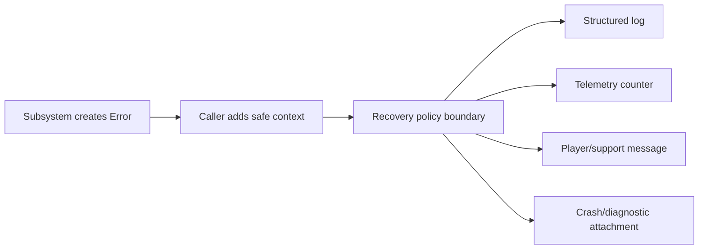

# Extensible error identity and handling

Status: Foundation implemented in ae_core (AE-* catalog + Result/report APIs); product adapters still pending

Implementation is sequenced through
[Ahamkara foundation #62](https://github.com/tfq26/Project-Ahamkara/issues/62),
[Wish envelope #63](https://github.com/tfq26/Project-Ahamkara/issues/63), and
[Flashback presentation #64](https://github.com/tfq26/Project-Ahamkara/issues/64).
The design remains authoritative for semantics; the issues own mutable work
state and acceptance progress.

## Decision requested

Adopt a stable, searchable error identity system in Ahamkara and a compatible
cross-product envelope that Flashback and Wish can extend without importing
each other's code.

This proposal complements the existing categorized logger, telemetry registry,
crash dumps, and diagnostic bundles; it does not replace them.
[src: file: engine/core/include/ae/core/log.h:11-84]
[src: file: engine/core/include/ae/core/telemetry.h:109-190]
[src: file: engine/core/include/ae/core/crash_handler.h:21-137]
[src: file: engine/core/include/ae/core/diagnostics.h:29-66]

## What Destiny's public model gets right

Bungie's support model separates platform-generated errors from
Destiny-generated errors. Destiny codes are usually memorable single words,
and the code directs players to a code-specific help page.
[src: url: https://help.bungie.net/hc/en-us/articles/360049496971-Error-Codes-Disconnected-From-Destiny]

The operational behavior is more important than the word theme:

- the code is shown at the failure boundary so the player can report it;
- support checks known service status before asking the player to alter a local
  setup;
- repeated occurrences of one code are treated as evidence of one likely root
  issue, while several different codes suggest a wider or unstable failure;
- individual codes can provide concrete remediation, such as repairing corrupt
  files for MARMOT or installing the current update for CAT.

[src: url: https://help.bungie.net/hc/en-us/articles/360049496971-Error-Codes-Disconnected-From-Destiny]
[src: url: https://help.bungie.net/hc/en-us/articles/4405096052244-Error-Code-MARMOT]
[src: url: https://help.bungie.net/hc/en-us/articles/360049196971-Error-Code-CAT]

There are also limitations worth avoiding. WEASEL is documented as a broad
networking error with several possible situations, and Bungie previously split
it out of CENTIPEDE to make investigations more specific. GUITAR demonstrates
that a memorable code may represent a server resource/state failure rather
than a client network fault.
[src: url: https://help.bungie.net/hc/en-us/articles/360048717852-Error-Code-WEASEL]
[src: url: https://help.bungie.net/hc/en-us/articles/360049201971-Error-Code-GUITAR]

The Ahamkara design therefore keeps codes short and searchable, but makes the
subsystem and failure identity semantic rather than assigning unrelated animal
names.

## Goals

- Give players, developers, automated tests, and support the same stable error
  identity.
- Separate a stable code from a mutable message and low-level native error.
- Preserve a causal chain and bounded diagnostic context across subsystem
  boundaries.
- Attach recovery policy, correlation, telemetry, and support documentation to
  the same descriptor.
- Allow Ahamkara, Flashback, and Wish to own independent code namespaces.
- Work in C++20 without requiring exceptions or C++23 `std::expected`.
- Fail safely without recording secrets, authentication tokens, or unnecessary
  personal data.

## Non-goals

- Giving every warning log a public error code.
- Encoding severity or retry behavior permanently into the code string.
- Exposing raw driver, socket, filesystem, or backend messages to players.
- Creating one shared source repository that makes Wish depend on Ahamkara.
- Treating an error code as a substitute for a crash dump, log, metric, or
  incident identifier.

## Stable code format

Use this display and wire format:

```text
<product>-<domain>-<number>
```

Examples:

```text
AE-NET-1004   Ahamkara connection lost
AE-AST-1002   Ahamkara asset content corrupt
FB-GME-1001   Flashback gameplay content incompatible
WS-AUT-1002   Wish authentication rejected
```

### Product namespaces

| Prefix | Owner | Rule |
|---|---|---|
| `AE` | Ahamkara | Engine/runtime failures only |
| `FB` | Flashback | Game, content, and product-presentation failures |
| `WS` | Wish | Identity, session, activity, service, and backend failures |

Each repository owns and publishes only its namespace. A code is never reused,
even after deprecation.

### Ahamkara domains

| Domain | Owner |
|---|---|
| `COR` | Core utilities and invariants |
| `CFG` | Configuration and command-line parsing |
| `IO` | Generic filesystem and stream operations |
| `AST` | Asset formats, loading, and import contracts |
| `PLT` | Window, input-device, and operating-system integration |
| `RUN` | Runtime lifecycle and game-module hosting |
| `NET` | Transport, protocol, connection, and network timing |
| `RND` | Renderer backend, GPU resources, and shaders |
| `ANI` | Animation data and evaluation |
| `PHY` | Physics simulation |
| `COL` | Collision shapes, queries, and filters |
| `AUD` | Audio devices, resources, and playback |
| `UI` | Engine-owned user-interface infrastructure |
| `TOL` | Engine tools and asset cooking |

Numbers are monotonically allocated inside a product/domain pair. They do not
encode severity, platform, or HTTP status; those properties can change without
breaking the public identity.

## Error model

The proposed Ahamkara core API has four layers.

### `ErrorCode`

A small value type containing product prefix, domain, and number. It supports
formatting, parsing, equality, hashing, and compile-time construction. Invalid
or unregistered codes fail tests and debug validation.

### `ErrorDescriptor`

An immutable registry record:

```cpp
struct ErrorDescriptor {
    ErrorCode code;
    std::string_view symbol;            // connection_lost
    std::string_view message_key;       // errors.net.connection_lost
    std::string_view owner;             // engine/network
    ErrorClass failure_class;
    RecoveryPolicy default_recovery;
    std::string_view support_slug;
};
```

`symbol`, localized message text, support URLs, and recovery policy may evolve;
`code` never changes. Registries are read-only after startup and reject
duplicates.

### `Error`

A failure occurrence carries:

```cpp
struct Error {
    ErrorCode code;
    ErrorSeverity severity;
    RecoveryPolicy recovery;
    IncidentId incident_id;
    std::string diagnostic;             // developer-facing, never localized
    SmallContext context;               // bounded, allow-listed key/value data
    std::shared_ptr<const Error> cause;  // optional causal chain
    std::source_location origin;
};
```

The implementation should avoid heap allocation on known fatal paths. The
sketch expresses ownership, not the final storage strategy.

### `Result<T>`

Recoverable operations return an engine-owned C++20 `Result<T>` containing a
value or `Error`. Do not use empty optionals, booleans plus a later log, or
exceptions across module/repository boundaries when callers must distinguish
failure causes.

## Classification axes

These fields are separate because they answer different questions:

| Axis | Examples | Question answered |
|---|---|---|
| `ErrorCode` | `AE-NET-1004` | What stable failure occurred? |
| `ErrorClass` | timeout, unavailable, corrupt-data, incompatible, capacity, permission, invariant, internal | What kind of failure is it? |
| `ErrorSeverity` | notice, recoverable, degraded, fatal | How badly did this occurrence affect the product? |
| `RecoveryPolicy` | none, retry-now, retry-backoff, reload-resource, reconnect, restart-product, repair-content, contact-support | What may the boundary do next? |
| `IncidentId` | random 64/128-bit identifier | Which exact occurrence joins client, server, and telemetry evidence? |

The same stable code may be recoverable in an editor and fatal during a
shipping-game boot, which is why severity is not encoded into the code.

## Propagation rules

1. Create the error once at the lowest boundary that can assign a precise
   semantic code.
2. Preserve the code while adding safe context and causal errors on the way up.
3. Convert native failures to `native_domain` and `native_code` context; do not
   make raw native values the player-visible identity.
4. Report once at the policy boundary. Lower layers return errors instead of
   both logging and returning the same failure.
5. Recovery is owned by the boundary with enough state to act: resource
   manager, connection state machine, game-module host, or application.
6. If recovery fails, return a new higher-level error with the original as its
   cause rather than overwriting it.
7. Assertions remain programmer-invariant checks. A caught invariant failure at
   a product boundary may produce a fatal error code, but normal invalid input
   must not crash through an assertion.

## Reporting pipeline



One `ErrorReporter` should fan a reported occurrence to configured sinks. The
existing logger can receive code, incident ID, severity, and context; telemetry
can aggregate counts by code; crash and diagnostic output can record the final
fatal code and incident ID.

## Player and support presentation

Display a plain-language action, stable code, and incident ID:

```text
The connection to the session was lost.
Try reconnecting. If this continues, check service status.

Code: AE-NET-1004
Incident: 7F4A-19C2
```

- Do not show stack traces, filesystem paths, IP addresses, tokens, or backend
  response bodies.
- A support page is keyed by the stable code and begins with service status
  when the error may be server-side.
- Multiple different errors in one incident retain their causal chain; the UI
  shows only the actionable top-level code.
- Platform-generated failures remain labeled as external platform errors and
  preserve the external code separately.

## Cross-repository envelope

Wish remains independent by implementing the shared envelope contract locally,
not by linking Ahamkara core. A safe wire response contains:

```json
{
  "code": "WS-AUT-1002",
  "incident_id": "7F4A19C2",
  "message_key": "errors.auth.rejected",
  "retry_after_ms": 0
}
```

Diagnostic detail and causal chains remain server-side. Flashback maps the
message key to product text and may attach the Wish incident ID to its local
diagnostic bundle.

## Initial reserved catalog

The proposed identities are maintained once in
[the operations catalog](../operations/error-codes.md). They must not be
emitted until the registry, tests, recovery behavior, and support entry exist.
Flashback and Wish allocate their own catalogs in their future repositories;
examples in this proposal reserve no binding implementation for those
namespaces.

## Risks and guardrails

This design will fail if it becomes a mass renaming of log strings. The first
implementation must prove recovery and support behavior at a few real
boundaries before broad conversion.

- A public C++ `Error` containing STL types is acceptable between the current
  statically linked engine modules, but it is not a safe long-term plugin ABI.
  A dynamic game-module boundary needs a versioned C-compatible view or a
  serialized envelope containing the code and incident ID.
- Automatic retries can amplify an outage. Every retry policy needs a maximum
  attempt count, exponential backoff, jitter where clients synchronize, and a
  cancellation path.
- Incident IDs and free-form context are high-cardinality data. They belong in
  logs/traces, not metric labels; metrics aggregate by stable code, recovery
  outcome, build, and bounded platform class.
- A code that covers several different player actions is too broad. Telemetry
  should measure generic/unknown-code frequency and trigger code splits without
  changing the historical meaning.
- A hand-maintained registry, localization table, operations catalog, and
  support site can drift. CI needs to validate that every active descriptor has
  exactly one catalog entry and message key; one canonical machine-readable
  registry may generate the secondary tables later.
- The error path itself must remain available under low-memory, device-loss,
  and crash conditions. Fatal reporting needs bounded storage and must not rely
  on the failed renderer, audio device, or network connection.
- Error context is a data-exfiltration surface. Allow-list keys by descriptor,
  cap sizes and causal depth, redact before persistence, and test malicious
  backend/native messages.

## Registry maintenance rules

- Add a code only for a failure that crosses a meaningful handling or support
  boundary.
- The code addition, descriptor, unit test, support catalog entry, and recovery
  test land together.
- Never change the meaning of an active code. Create a new code and deprecate
  the old one.
- Never reuse a number.
- Keep one owner and one support entry per active code.
- Review context fields for secrets and personal data.
- Track implementation work in GitHub Issues; do not turn this catalog into a
  backlog.

## Rollout

1. Add `ErrorCode`, descriptor registry, `Error`, `IncidentId`, and C++20
   `Result<T>` to `ae_core` with formatting, parsing, duplicate detection, and
   propagation tests.
2. Integrate structured reporting with logging, telemetry, crash context, and
   diagnostic bundles.
3. Convert narrow leaf boundaries first: configuration, asset loading, socket
   setup, render initialization, and audio initialization.
4. Add application-level recovery and player presentation.
5. Define the independent Wish wire envelope and Flashback presentation
   adapter after repository boundaries are established.
6. Measure unknown/generic-code frequency; split codes when telemetry proves a
   broad code hides distinct remediations.

## Validation bar

- Compile-time and runtime duplicate-code detection.
- Round-trip format/parse tests for every registered code.
- Tests proving messages can change without changing code identity.
- Cause-chain and context-bound tests.
- Secret-redaction tests.
- Recovery-policy tests for retry, fallback, reconnect, and fatal paths.
- Telemetry aggregation by code without high-cardinality context labels.
- Crash/diagnostic tests proving the final code and incident ID are attached.
- Cross-process test joining a Wish response and Flashback diagnostic by
  incident ID without sharing implementation types.
